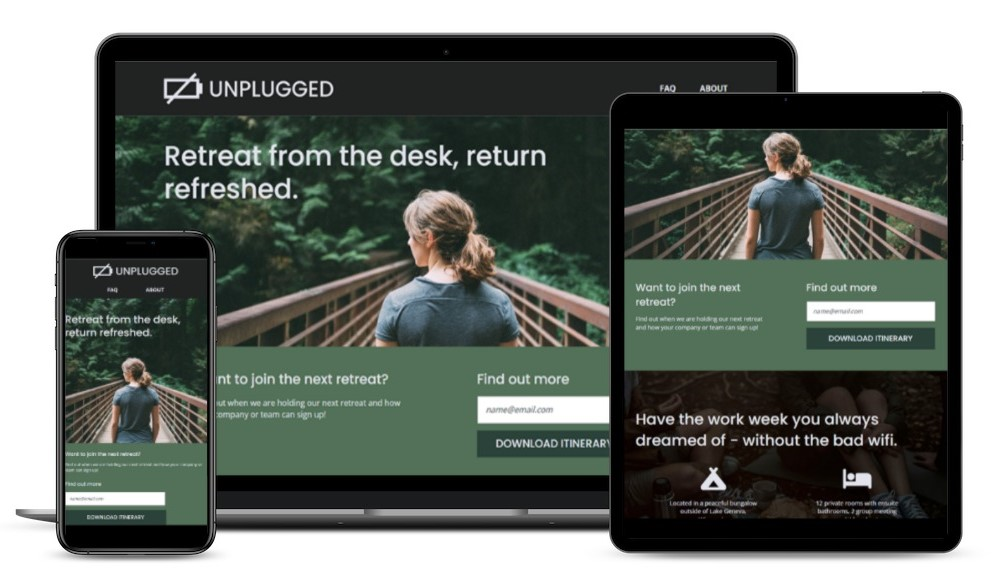

# Unplugged Retreat

A multipage responsive website for a tech industry retreat.

## Project Details

### View My Project: [https://ll-zerr.github.io/unplugged/](https://ll-zerr.github.io/unplugged/)

## Features

- Homepage with retreat features and reviews
- About page with mission statement and Google map integration
- FAQ page addressing common concerns
- All pages have consistent contact info and social media links 

## Technologies Used

- HTML5
- CSS3
- Chrome Dev Tools

## Acknowledgements

Project Idea: [Skillcrush](https://Skillcrush.com)

Original CSS provided by: [Skillcrush](https://Skillcrush.com)